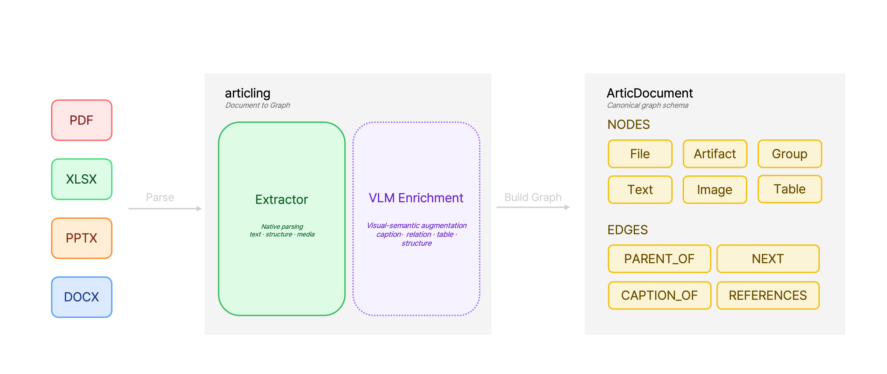

# 🕸️ Articling

> **Turn documents into structured graphs.**

[](https://github.com/san9min/articling/actions/workflows/tests.yml)
[](LICENSE)
[](pyproject.toml)
[](https://pydantic.dev)

**Articling** is a lightweight Python SDK and CLI that turns
**DOCX, PPTX, XLSX, and PDF** into a unified, typed document graph.

## What is Articling?

Articling reads DOCX/PPTX/XLSX/PDF directly with **format-native libraries**
(no LibreOffice needed — the core doesn't need a VLM/API either; opt-in
enrichment like `CAPTION_OF`/`REFERENCES` proposals and heading promotion is
what uses a VLM) and turns them into a typed **document graph**
(`ArticDocument`). Unlike document-tree models such as docling, it represents
caption/reference relationships as nodes and edges too, designed to **connect
straight to Neo4j**.

PPTX extraction preserves OLE object metadata and original preview bytes,
including WMF/EMF. Normalized bounding boxes include nested group translation,
scaling, rotation, and reflection; raw geometry stays in its parent coordinate
system. A textless shape drawn directly on top of a picture (a highlight box,
an unglued arrow) never becomes its own node, but is composited onto that
picture's saved image instead of being lost, mirroring how XLSX preserves
annotations drawn on top of a photo. A native chart becomes a Table node
(its categories/series data, not a re-rendered picture); SmartArt has no
python-pptx object model or rendering support at all, so its typed text
labels are recovered from the diagram's data instead of being lost. A
native table also gets a visual capture (cell shading, merges, borders),
the same as XLSX tables, since the slide-reconstruction renderer already
knows how to draw one.

PPTX VLM enrichment reconstructs slide images locally with `python-pptx` and
Pillow. No LibreOffice, PowerPoint, AppleScript, or external converter runs:

```bash
python -m articling.cli deck.pptx --vlm-enrichment --check -o graph.json
```

Reconstruction reads source shapes in paint order, including background artwork,
picture cropping/transparency/rotation, common shapes and connectors, text runs,
and merged table cells. It preserves the slide aspect ratio. Font substitution
and text fitting keep text inside its own box; they can differ from PowerPoint's
typography. WMF/EMF previews, SmartArt, complex geometry/effects, and table theme
styles are not fully reproduced. Per-slide warnings identify substitutions,
fitted text, and skipped shapes. A failed shape does not abort other shapes.

The VLM receives a clean reconstruction followed by a copy with `visual_id`
labels. These images are explicitly marked approximate; missing visual details
must not be treated as proof of absence. Each slide is cached across anchors
within an enrichment stage. Native extraction itself still makes no VLM calls.

To inspect or save a reconstruction without API access:

```python
from pathlib import Path
from articling.capture.pptx_capture import PptxSlideRenderer

renderer = PptxSlideRenderer("deck.pptx")
try:
    slide = renderer.render(0)  # zero-based
    Path("slide-1.png").write_bytes(slide.png)
    print(slide.warnings)
finally:
    renderer.close()
```

Existing `--slide-images slides.json` remains available with `--vlm-enrichment`:
externally supplied full-slide PNG/JPEGs take precedence over reconstruction.
The JSON maps every zero-based slide index to a path relative to the JSON file,
e.g. `{"0": "slides/Slide1.png", "1": "slides/Slide2.png"}`. Export the exact same
deck without cropping. Slide count and aspect ratio are checked; content identity
remains the caller's responsibility. An unreadable supplied image falls back to
native reconstruction. If the source is unavailable too, processing continues
with text and available individual images. Synthetic sibling grouping in the
convenience enrichment bundle remains opt-in through supplied slide images.
API access requires `articling[relations]` and `OPENAI_API_KEY`.



*(The native PDF path does not create `Table`/vector `Image` nodes by
default — both are available as opt-in add-ons.)*

### Why VLM enrichment matters

A document isn't just data — it's an **artifact** a person made to
communicate something. People don't carry that meaning in text alone: they
set a paragraph as a large heading, place a table or figure right next to
the text that explains it, anchor a caption at a specific spot, and use
callout boxes or arrows to visually say "this points to that." That
**layout itself is information you need to understand the document** — not
incidental styling.

A native OOXML/PDF parser only recovers half of that. The **structure of the
format** — cells, paragraphs, shapes — comes out exactly right (the part the
core extracts deterministically, no VLM/API involved). But the **semantic
structure a person expressed through visual placement** — which figure a
caption actually describes, which section a paragraph actually belongs
under — can't be settled from XML tree order alone (when there are multiple
candidates immediately before or after, the ambiguity just stays; this is
also why `CAPTION_OF`/`REFERENCES` edges are a "deterministic heuristic +
LLM proposal" two-tier design). This is exactly where Articling's opt-in VLM
step comes in — showing the model the actual rendered pixels (a page crop, a
sheet crop, a slide layout map). Giving the model the same input a person
originally looked at is what lets it recover the layout information that a
plain text stream throws away.

## Quickstart

### 1. Install

```bash
pip install -e .
```

Requires Python 3.10+. Optional features are installed as extras:

```bash
pip install -e ".[relations]"          # LLM CAPTION_OF/REFERENCES proposals, VLM captions, PDF chunking, PDF table detection (OpenAI backend)
pip install -e ".[pdf-tables-local]"   # local-model backend for PDF table detection (torch/transformers/docling-core, heavy)
pip install -e ".[neo4j]"              # push_to_neo4j
pip install -e ".[dev]"                # pytest
```

### 2. Convert a document (CLI)

```bash
python -m articling.cli report.xlsx --format json -o report.json
python -m articling.cli report.xlsx --format cypher -o report.cypher
```

There's also `--vlm-enrichment` (2D layout-aware text merging + same-line
fragment merging + heading promotion + numbered-subheading nesting +
CAPTION_OF/REFERENCES proposals, requires `OPENAI_API_KEY`,
`relations.propose.apply_vlm_enrichment`) and `--check` (graph invariant
checks) — see [references/cli.md](articling/.agents/skills/articling/references/cli.md)
for the full flag list.

### 3. Python usage

```python
from articling import extract
from articling.export.neo4j import to_cypher_script, push_to_neo4j

doc = extract("report.xlsx")
print(len(doc.nodes), len(doc.edges))

# Just the script, no connection
open("report.cypher", "w").write(to_cypher_script(doc))

# Or push straight into Neo4j (pip install "articling[neo4j]")
push_to_neo4j(doc, uri="bolt://localhost:7687", auth=("neo4j", "password"))
```

## Demo

There's a local demo app that shows the resulting graph interactively once
you upload a file:

```bash
pip install -r demo/requirements.txt
python demo/app.py
# -> http://127.0.0.1:8420
```

See [demo/README.md](demo/README.md) for usage and screenshots.

## Neo4j mapping

- `Node.type` → node label (`File`/`Artifact`/`Text`/`Table`/`Image`/`Group`)
- `Edge.type` → relationship type (`PARENT_OF`/`NEXT`/`CAPTION_OF`/`REFERENCES`)
- `Node.id` → `id` property, target of the uniqueness constraint (filename-based,
  so it stays unique even across merged documents)
- Nested properties (e.g. `Table.grid`, `capture_size`) are serialized as JSON
  strings, since Neo4j properties only allow scalars/arrays of scalars —
  `json.loads` them back on read.

## License

MIT — see [LICENSE](LICENSE).
